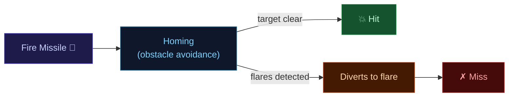
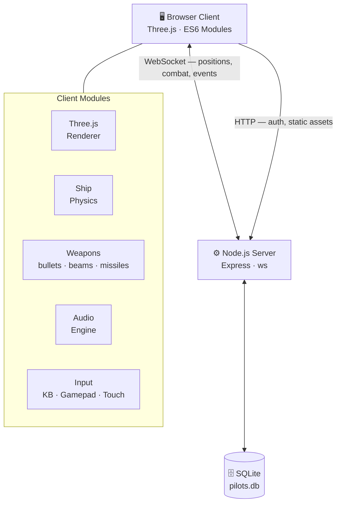

<div align="center">

# 🚀 SPACESHIPS

### 3D multiplayer space combat — pilot, fight, and dominate the asteroid field

[](https://gheat.net/spaceships)

[](https://threejs.org)
[](https://nodejs.org)
[](#)
[](#)
[](https://www.sqlite.org)
[](https://expressjs.com)
[](https://jwt.io)

</div>

---

## Table of Contents

- [Features](#-features)
- [Game Modes](#-game-modes)
- [Controls](#-controls)
- [Weapons](#%EF%B8%8F-weapons)
- [Architecture](#-architecture)
- [Project Structure](#-project-structure)
- [Tech Stack](#-tech-stack)
- [Credits](#-credits)

---

## ✨ Features

| | Feature | Description |
|:---:|:---|:---|
| 🌌 | **3D Space Combat** | Fully realized 3D environments with asteroids, moons, and a dynamic skybox |
| 🌐 | **Real-time Multiplayer** | Live dogfights with WebSocket sync across all connected pilots |
| 🎯 | **Campaign Mode** | Three-mission story arc with a boss capital ship, checkpoints, and a lives system |
| 🚀 | **Homing Missiles** | Smart missiles with obstacle avoidance — countered by flares |
| 🎨 | **Ship Customization** | Personalize your color scheme, saved to your pilot account |
| 🎮 | **Gamepad Support** | Full controller support via the Web Gamepad API |
| 📱 | **Mobile Ready** | Touch-friendly HUD with virtual joystick and on-screen buttons |
| 🤖 | **AI Opponents** | Bot pilots with pathfinding and combat logic |
| 🔒 | **Pilot Accounts** | Secure auth with bcrypt + JWT to track stats and customization |
| ⚡ | **60 FPS Optimized** | Frustum culling, instanced rendering, and batched WebSocket messages |

---

## 🎮 Game Modes

### Campaign

Three sequential missions, each unlocked by completing the previous one. Progress is saved locally.


> **Lives system:** You get 3 lives per run. Dying warp-flashes you back to the last checkpoint at 55% health — no full restarts.

The boss is a fully animated capital ship with 4 rotating turrets, patrol movement, and 12 hitbox zones spread across its hull.

### Multiplayer

Join or create a lobby and compete against other pilots in real time. Ship positions, rotations, weapon fire, and damage are all synchronized via WebSocket.

### Solo

Freeplay against AI bot opponents to sharpen your skills, or just explore the asteroid field at your own pace.

---

## 🕹️ Controls

### Keyboard & Mouse

| Input | Action |
|:---|:---|
| `W` / `S` | Thrust forward / back |
| `A` / `D` | Roll left / right |
| `Mouse` | Aim and look |
| `Left Click` | Fire bullets |
| `Right Click` _(hold)_ | Free-look camera |
| `F` | Fire homing missile |
| `Q` | Deploy flares _(missile countermeasure)_ |
| `Shift` | Boost |
| `Space` | Drift |

### Gamepad

| Input | Action |
|:---|:---|
| Left Stick | Roll / Throttle |
| Right Stick | Aim / Look |
| `RT` / `A` | Fire |
| `LB` | Boost |
| `LT` | Drift |
| Start | Menu |

### Touch

Virtual joystick on the left half of the screen drives movement. On-screen buttons handle weapons, boost, and drift. A throttle slider gives fine speed control.

---

## ⚔️ Weapons

| Weapon | Type | Notes |
|:---|:---|:---|
| **Bullets** | Rapid-fire projectiles | Short range, high rate of fire |
| **Beam** | Sustained energy weapon | Overheats with continuous use |
| **Missiles** | Homing projectiles | Navigates around asteroids; look-on-target to lock |
| **Flares** | Countermeasure | Deploys 20 decoys that burn ~1.8 s each burst |



---

## 🏗️ Architecture



---

## 📁 Project Structure

```
├── public/
│   └── src/
│       ├── main.js           # Game loop, state, campaign logic
│       ├── ship.js           # Ship model, movement, physics
│       ├── bot.js            # AI pathfinding and combat
│       ├── lobby.js          # Lobby, matchmaking, campaign routing
│       ├── auth.js           # Client-side authentication
│       │
│       ├── bullets.js        # Rapid-fire projectile system
│       ├── beams.js          # Sustained beam weapon
│       ├── missiles.js       # Homing missiles + flare countermeasures
│       │
│       ├── input.js          # Keyboard / mouse / gamepad
│       ├── touchhud.js       # Mobile touch controls
│       ├── camera.js         # Third-person camera
│       ├── customization.js  # Ship customization UI
│       ├── audio.js          # Sound effects and music
│       ├── filter.js         # Post-processing visual filters
│       │
│       ├── asteroids.js      # Asteroid generation and physics
│       ├── skybox.js         # Space background rendering
│       ├── trails.js         # Engine trail particles
│       ├── moon.js           # Moon rendering
│       ├── mothership.js     # Static mothership object
│       ├── warp.js           # Warp jump visual effect
│       │
│       ├── carrier.js        # Aircraft carrier (team base)
│       ├── terrain.js        # Ground terrain + airfields
│       ├── airfield.js       # Landing and spawn zones
│       ├── trees.js          # Environmental foliage
│       ├── water.js          # Water surface rendering
│       └── clouds.js         # Volumetric cloud layer
│
├── server/
│   ├── index.js              # Express routes + WebSocket handler
│   └── db.js                 # SQLite interface
│
├── index.html                # Entry point
└── pilots.db                 # Pilot accounts database
```

---

## 🛠️ Tech Stack

**Frontend**

[](https://threejs.org)
[](#)

**Backend**

[](https://nodejs.org)
[](https://expressjs.com)
[](https://www.sqlite.org)

**Auth & Security**

[](https://jwt.io)
[](#)

---

## 📄 License

This game and all its code, assets, and design are the exclusive property of the creators. Unauthorized copying, reproduction, distribution, or use of this game in any form is strictly prohibited.

---

## 👾 Credits

| Role | Contributor |
|:---|:---|
| Game creator | **Ian** |
| Online play & backend infrastructure | **Gheat** |

---

<div align="center">

**[▶ Play Now at gheat.net/spaceships](https://gheat.net/spaceships)**

</div>
